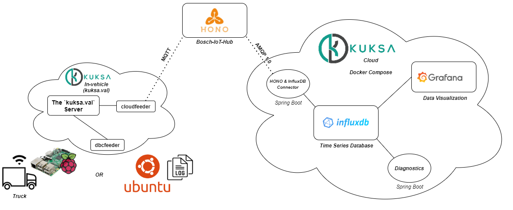

# DIAS-KUKSA

The detailed tutorial for getting started with [DIAS](https://dias-project.com/)-KUKSA can be found [here](https://dias-kuksa-doc.readthedocs.io/en/latest/).

The figure above illustrates the entire connectivity schema of the [DIAS](https://dias-project.com/)-KUKSA use-case with Eclipse KUKSA.

This repo provides means to establish Vehicle-to-Cloud connectivity in the context of DIAS-KUKSA.

##In-vehicle

In `./utils/in-vehicle/`, the supplementary in-vehicle components interacting with [KUKSA.val](https://github.com/eclipse/kuksa.val) are introduced.

##Cloud

In `./utils/cloud/`, the web-applications and their deployment methodology to run the DIAS-KUKSA cloud in a local machine are introduced.

##Canplayer

In `./utils/canplayer/`, the Python scripts to modify CAN trace log files for `canplayer` are introduced.
