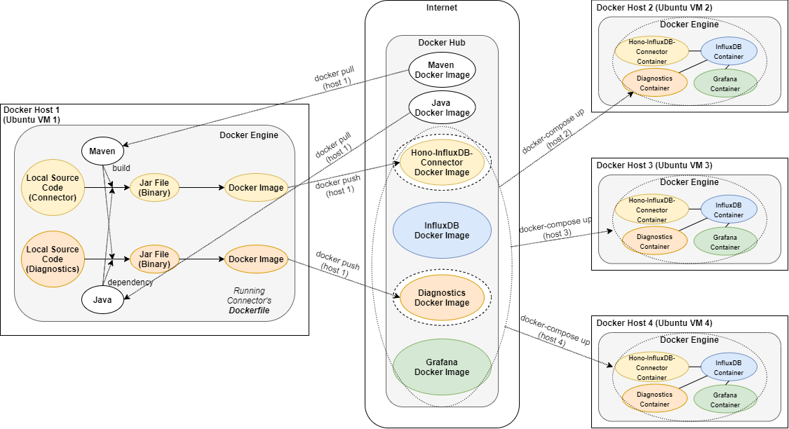

# Docker Compose Deployment for The DIAS-KUKSA Cloud



The figure above illustrates the schema of the Docker Compose deployment for the [DIAS](https://dias-project.com/)-KUKSA cloud.

This script is to deploy all services required for operating the DIAS-KUKSA cloud.
These services include: `InfluxDB`, `Hono-InfluxDB-Connector`, `Diagnostics`, and `Grafana`.

## Prerequisites - docker, docker-compose

* Docker, Compose [How to install Docker on Ubuntu 18.04](https://phoenixnap.com/kb/how-to-install-docker-on-ubuntu-18-04)

## Step 1: Set your email address in `grafana.ini` if you want to set the Grafana notification enabled

```
[smtp]
..
user = your@email.address
password = your_email_password # if you are using Gmail, you should have 2FA enabled and create an App password for this.
```

## Step 2: Set the receiver's email address in ./grafana-provisioning/notifiers/notifier.yaml

```
notifiers:
    ..
    settings:
      addresses: receiver_1@email.address; receiver_2@email.address
```

## Step 3: Set the `.env` file in the same directory where this `README.md` file is located according to the credential information of your Hono instance's information (stated in [Bosch-IoT-Suite Subscription Page](https://accounts.bosch-iot-suite.com/subscriptions/)) and your preference for evaluation.

```
HONO_TENANTID=your_hono_tenant_id
HONO_MESSAGINGPW=your_hono_messaging_password

INFLUXDB_URL=http://influxdb:8086
INFLUXDB_USERNAME=admin
INFLUXDB_PASSWORD=admin
INFLUXDB_DATABASE=dias_kuksa_tut

GRAFANA_USERNAME=admin
GRAFANA_PASSWORD=admin

# Relative directory of the properties file that includes the reference NOx map to load.
CONFIG_PROPERTIES_LOCATION=./diagnostics_config/
# ex) EVALUATION_POINT=350
EVALUATION_POINT=evaluation_duration_in_seconds
# ex) EVALUATION_TARGET=tscr_bad
EVALUATION_TARGET=nox_map_for_evaluation
# PRE_EVALUATION_DISABLED=false
PRE_EVALUATION_DISABLED=true_or_false
```
- For CONFIG_PROPERTIES_LOCATION, `/diagnostics_config/` can be found in the same directory where `docker-compose.yml` is located.)

- For EVALUATION_TARGET, choose one among the six following choices: 

1. `tscr_bad`
2. `tscr_intermediate`
3. `tscr_good` 
4. `old_good` 
5. `pems_cold`
6. `pems_hot`

- For PRE_EVALUATION_DISABLED, choose one between the two following choices:

1. `false`

This enables the pre-evaluation process.

2. `true`

This disables the pre-evaluation process.

## Step 4: Navigate to the same directory where this `README.md` file is located and run Docker Compose (with the detached mode)

~~~
$ docker-compose up -d
~~~

## Step 5-A: Take all the services down but do not terminate volumes (for persistence)

~~~
$ docker-compose down
~~~

## Step 5-B: Take all the services down and also terminate volumes

~~~
$ docker-compose down --volumes
~~~
