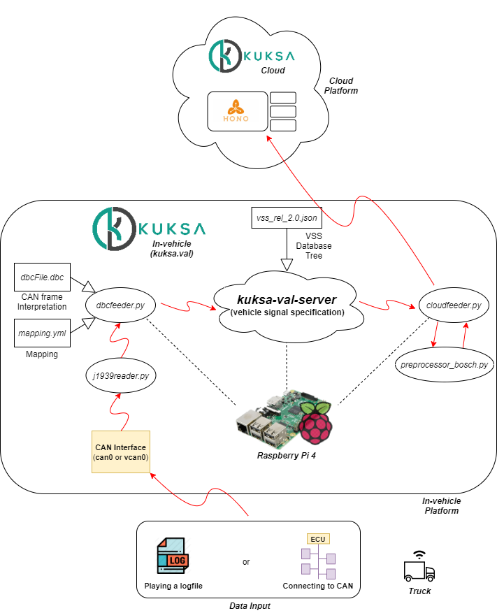

# DIAS-KUKSA: In-vehicle

The detailed tutorial for the DIAS-KUKSA cloud can be found [here](https://dias-kuksa-doc.readthedocs.io/en/latest/contents/invehicle.html).

## CloudFeeder & Preprocessor-Bosch

As illustrated in the figure above, `cloudfeeder.py` pre-processes the vehicle signal data with `preprocessor_bosch.py` and send the result telemetry message to the running `Bosch-IoT-Hub` (`Hono`) instance. These two Python scripts, `cloudfeeder.py` and `preprocessor_bosch.py`, can be found in `./cloudfeeder_telemetry/`.

## DBCFeeder Example Arguments

As illustrated in the figure above, it requires two external files for `dbcfeeder.py` to run. These include a DBC file and a mapping file. 

1. A DBC file is expected to be provided by the target vehicle's manufacturer. An example DBC file is omitted due to the copyright issue. If there is no DBC file available, you can copy the entire string from [J1939 DBC Example](https://hackage.haskell.org/package/ecu-0.0.8/src/src/j1939_orig.dbc) and save it as `dbcfile.dbc` and locate the file to `kuksa.val/clients/feeder/dbc2val/`, where `dbcfeeder.py` is located.

2. A mapping file maps the decoded signals to their corresponding paths in the in-vehicle GENIVI VSS server, `kuksa-val-server`. This can be found in `./dbcfeeder_example_arguments/` and shall also be located in `kuksa.val/clients/feeder/dbc2val/`, where `dbcfeeder.py` is located..

## J1939Reader

As illustrated in the figure above, `j1939reader.py` reads decodes the incoming CAN messages into signals and send it to the `dbcfeeder.py`. This has already been merged to KUKSA.val. [(J1939 Reader in KUKSA.val)](https://github.com/eclipse/kuksa.val/blob/master/clients/feeder/dbc2val/j1939reader.py) This can be found in `./j1939feeder/`.

## Vehicle Signal Specification Example File Structure

A file structure to create a JSON data structure file for the in-vehicle GENIVI VSS server, `kuksa-val-server`, can be found in `./vss_structure_example/`.

## confvcan.sh & dualcan.sh

1. `confvcan.sh` is to set up a virtual CAN interface, `vcan0`, for Raspberry to read CAN messages. This is used for the purpose of playing CAN traces using `canplayer` without connecting the Raspberry Pi to the actual CAN.

2. `dualcan.sh` is to set up two physical CAN interfaces, `can0` and `can1`, for Raspberry to read CAN messages. This is used when connecting the Raspberry Pi to the actual CAN of the target vehicle's ECU.

Please refer to [CAN Interface for Hardware](https://dias-kuksa-doc.readthedocs.io/en/latest/contents/hwsetup.html#can-interface-for-hardware) for more details.
